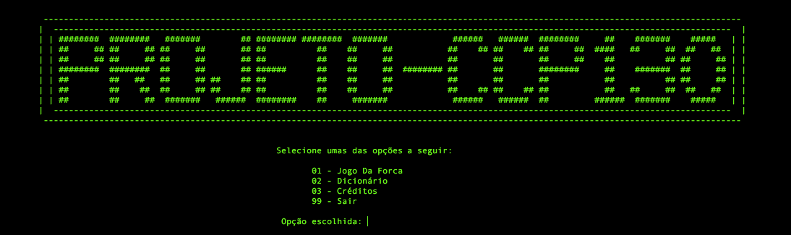
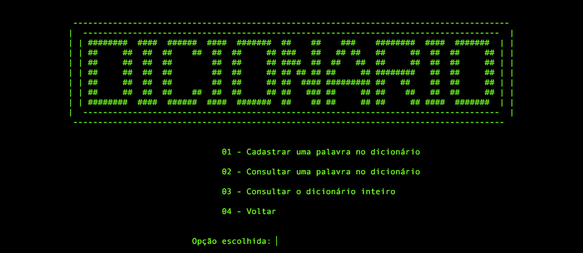
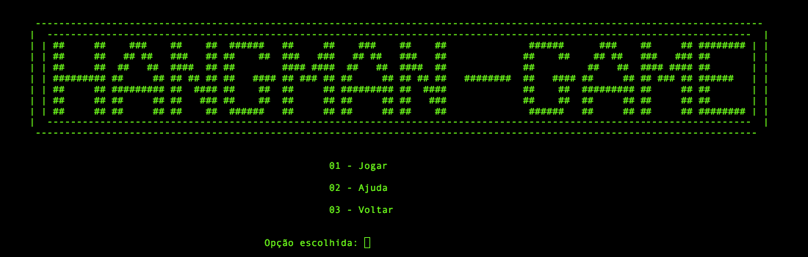

# Project - CCP 130 
> Is a Hangman Game written in [C](https://en.wikipedia.org/wiki/C_(programming_language)) language. The program catch a random word in the dictionary and the player(s) tries to guess it by suggesting letters within a certain number of guesses.
> 
<p align="center">
  
</p>

## Prerequisites
* [IDE](https://code.visualstudio.com/)
* [Git](https://git-scm.com/)
* [Compiler](https://gcc.gnu.org/) (I strongly recommend GCC but you can use G++)


## Installation

Mac OS X & Linux & Windows:

```sh 
git clone https://github.com/LucasLagoeiro/Project-CCP130.git
```

After this you just need to run the Compiler:
```sh
gcc main.c -o exec && .\exec
```
## The Project
> When you run the code, you enter the main menu where you can decide if you want to enter the dictionary or play the famous Hangman Game.
<p align="center">
    <u><b>Main Menu</b></u>
</p>



<p align="center">
  <u><b>Dictionary Menu </b></u> 
</p>

<p align="center">
  
</p>

<p align="center">
   <u><b>Hangman Game Menu </b></u> 
</p>





## Updates

* 3.0.0 (is coming...)
    * FIX: The bug when you type the same wrong word it decreases your attempt at the Hangman Game
* 2.0.1
    * Updates README.
    * ADD: A new folder (imgs).
* 2.0.0
    * ADD: An Interface (Project Menu,Dictionary Menu, HangmanGame Menu).
    * FIX: some bugs.
* 1.0.0
    * The first stable release.


## Meta
The ideia of project is by the professor [@danilo_perico](https://github.com/danilo-perico) on CCP130 subject in the [University Center of FEI](https://portal.fei.edu.br/)

Lucas Lagoeiro - [@DevLagoeiro](https://twitter.com/DevLagoeiro) - devlagoeiro@outlook.com

[https://github.com/LucasLagoeiro](https://github.com/LucasLagoeiro)
